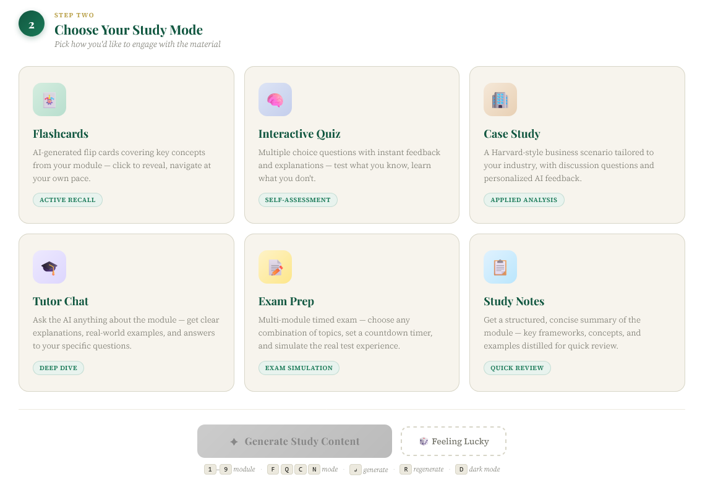
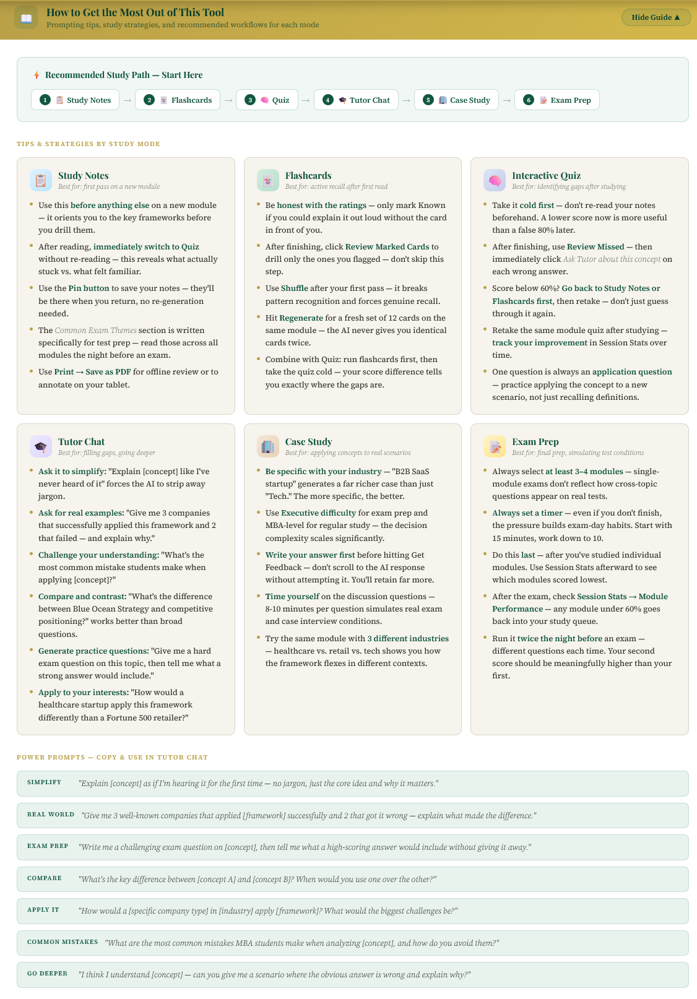
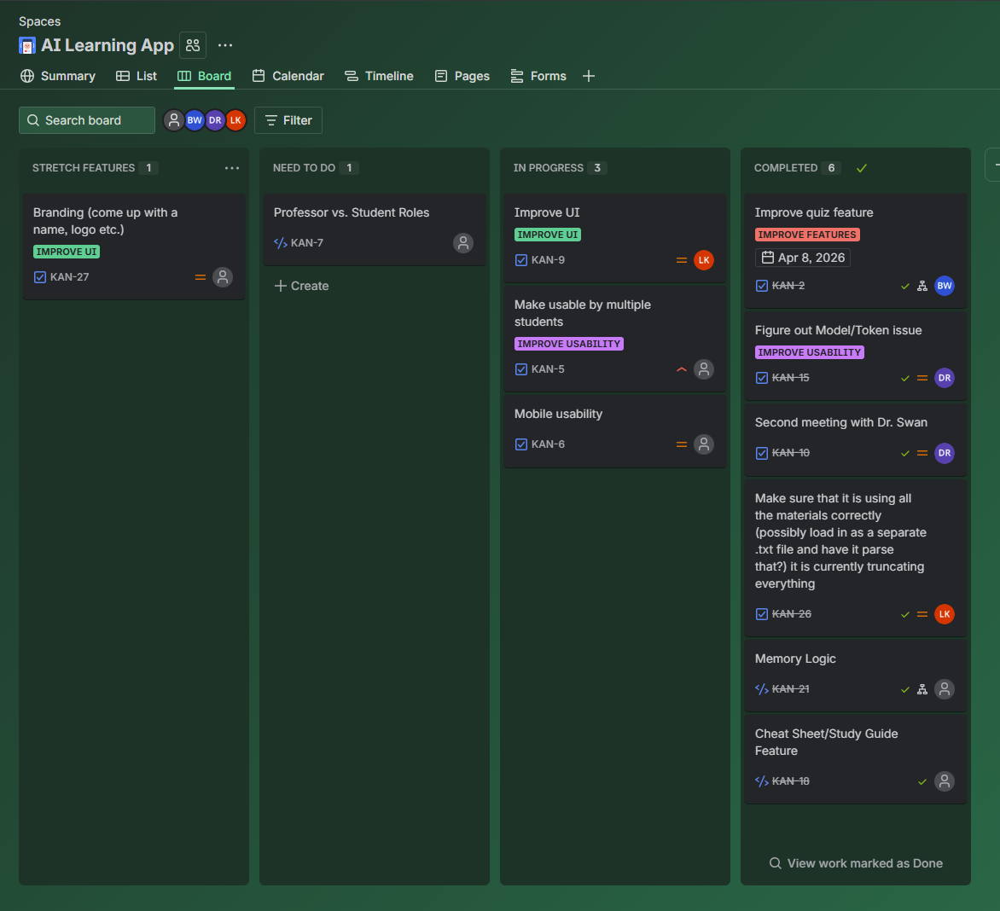

# AI-Powered Study Suite
### An intelligent, course-specific study tool built on large language models

**[Live Demo](https://zzitsluke.github.io/wm_groq)** — bring your own free [Groq API key](https://console.groq.com)

---

```
┌─────────────────────────────────────────────────────────────────┐
│                                                                   │
│   Student selects        AI generates          Student learns    │
│   topic + mode    ──▶   personalized    ──▶   with quizzes,     │
│   (quiz, notes,         content via           flashcards,        │
│    case study...)       Groq LLM API          case studies       │
│                                                                   │
└─────────────────────────────────────────────────────────────────┘
```


> **Why this matters for businesses and educators:**
> Static training materials don't scale to individual learning needs — and producing custom practice content manually is expensive and time-intensive. This tool demonstrates how organizations can embed LLM-powered interactivity directly into existing educational workflows at near-zero infrastructure cost, with no AI expertise required from the end user.

```
  Traditional approach          This tool
  ──────────────────            ──────────────────────────────────
  Instructor writes             AI generates on demand:
  practice questions  →         • Flashcards
  (hours of work,               • Quizzes with scoring
   done once,                   • Structured notes
   same for everyone)           • Case studies
                                • Tutor chat (multi-turn)
                                • Full practice exams
                                  — personalized, instant, free
```

---

## Table of Contents
1. [Authors](#authors)
2. [Project Scope](#project-scope)
3. [Project Details](#project-details)
4. [Agentic Design](#agentic-design)
5. [Architecture](#architecture)
6. [API Security](#api-security)
7. [What's Next](#whats-next)
8. [Project Management](#project-management)
9. [Responsible AI Considerations](#responsible-ai-considerations)
10. [References](#references)

---

## Authors

| Name |
|---|
| [Luke Kovats](https://github.com/zzitsluke) |
| [Dean Rarick](https://github.com/djrarick) |
| [Brandon Ward](https://github.com/brandonw203) |
| [Jessie Lin](https://github.com/jiexilin058) |

---

## Project Scope

This project is narrowly scoped to a **single-course, instructor-defined AI study assistant** — not a general-purpose chatbot or full LMS replacement.

Specifically, the tool:
- Serves **one course at a time**, with module content defined and controlled by the instructor
- Generates **six study modes** (flashcards, quizzes, notes, case studies, tutor chat, practice exams) from that content
- Uses a **server-stateless architecture** — the backend stores nothing; all session state lives in the student's own browser
- Is deployed as a **lightweight web application** accessible via a shared URL, with no student installation required

The scope explicitly excludes: user authentication, persistent cloud data, cross-course support, LMS integration, and grading functionality.

---

## Project Details

### The Problem

Business school instructors face a structural challenge: students have access to the same static study materials (slides, readings, notes) semester after semester, but learning outcomes improve when students engage with content actively — through practice, self-testing, and application to novel scenarios. Creating that variety of practice material manually is time-intensive and rarely scales to individual student needs.

### The Solution

This tool takes instructor-provided course content and makes it interactively queryable through a simple web interface. Students select a topic and a study mode, and the system generates targeted content on demand using a large language model.

```
┌──────────────┐     POST /api/chat      ┌──────────────────┐
│   Browser    │ ──────────────────────▶ │  Flask Backend   │
│ (index.html) │                         │    (app.py)      │
│              │ ◀────────────────────── │                  │
└──────────────┘    Anthropic-shaped     └────────┬─────────┘
                       response                   │
                                                  │ Groq API call
                                                  ▼
                                        ┌──────────────────┐
                                        │    Groq LLM      │
                                        │ (llama-3.3-70b)  │
                                        └──────────────────┘
```

### Study Modes



| Mode | Description |
|---|---|
| **Flashcards** | Key concept pairs generated from module content |
| **Quiz** | Multiple-choice questions with explanations and scoring |
| **Notes** | Structured summaries of frameworks and key ideas |
| **Case Study** | AI-generated business scenario with discussion questions |
| **Tutor Chat** | Multi-turn conversational Q&A grounded in course material |
| **Practice Exam** | Multi-module timed exam with configurable question count |

### Technical Stack

| Layer | Technology | Rationale |
|---|---|---|
| Frontend | HTML / CSS / JavaScript (single file) | Zero build tooling, fully portable |
| Backend | Python / Flask | Lightweight, minimal dependencies |
| LLM Provider | Groq API (llama-3.3-70b-versatile) | Free tier, fast inference, OpenAI-compatible |
| Hosting | GitHub Pages (demo) / Python host (full) | Static demo requires no server; full backend deployable to any Python host |
| Progress Storage | Browser localStorage | No backend database, no PII collected |

### Key Design Decisions

**Why Groq instead of OpenAI?**
Groq's free tier provides sufficient token throughput for a classroom setting at no cost, and its OpenAI-compatible API format minimized frontend changes. The backend translates responses to Anthropic's message shape, which the frontend already expected.

**Why a single HTML file for the frontend?**
Keeping the frontend as a single file with no build step makes the project fully portable. Any developer can open, read, and modify the interface without installing a build toolchain.

**Why no user accounts in v1.0?**
Adding authentication adds infrastructure complexity, privacy obligations, and deployment friction. For an initial deployment, browser localStorage provides adequate progress persistence per device.

### Progress Tracking

Student progress is stored in the browser's `localStorage` under the following keys:

| Key | Contents |
|---|---|
| `wm_studied` | Array of module names the student has engaged with |
| `wm_mastery` | Object mapping module → quiz/exam score percentage |
| `wm_pinned` | Array of pinned content items |
| `wm_streak` | Integer day-streak count |
| `wm_sessions` | Total session count |

This data persists across browser sessions on the same device and is never transmitted to any server.

---

## Agentic Design

This application incorporates several agentic AI design patterns — behaviors where the system autonomously makes decisions, adapts to context, and takes multi-step actions rather than simply passing a fixed prompt to an LLM.

### Autonomous Model Routing
The frontend selects which LLM to invoke based on the complexity of the requested task, before the API call is made. Lightweight study modes (flashcards, quizzes, notes, tutor chat) use `llama-3.1-8b-instant` for speed; complex generation tasks (case studies, practice exams) are automatically routed to `llama-3.3-70b-versatile` for higher quality output. This routing logic runs without any user input.

```
User request
    │
    ├── flashcard / quiz / notes / tutor  ──▶  llama-3.1-8b-instant  (fast)
    │
    └── case study / exam                 ──▶  llama-3.3-70b-versatile  (capable)
```

### Dynamic Prompt Construction
Rather than using a static template, the system constructs each prompt at runtime by embedding the full relevant course module content, the selected study mode, and (in tutor mode) the live conversation history. The prompt is never the same twice.



### Multi-Turn Conversational Memory (Tutor Mode)
The Tutor mode maintains a rolling conversation window across multiple exchanges. The system autonomously manages context — prepending the course material as a system context on the first message, then appending subsequent turns — enabling coherent multi-step tutoring sessions without the student managing session state.

```
Turn 1:  [course material + student question]  →  AI answer
Turn 2:  [turn 1 context + follow-up]          →  AI answer
Turn N:  [first turn (anchored) + last 4 turns]  →  AI answer
```

### Automatic Output Repair
When the LLM returns malformed JSON (a common failure mode for structured generation tasks like quizzes and flashcards), the application automatically attempts to parse and repair the output before surfacing an error to the user. This self-correction loop reduces user-visible failures without requiring a manual retry.

### Retry Logic with Exponential Backoff
The backend automatically retries failed Groq API connections up to 3 times with exponential backoff, recovering from transient network errors without surfacing them to the student.

---

## Architecture

```
project/
├── app.py              # Flask backend — LLM proxy, static file serving
├── requirements.txt    # Python dependencies
├── .env                # API key (excluded from repo via .gitignore)
└── static/
    └── index.html      # Complete frontend — UI, prompts, rendering logic
```

**Request lifecycle:**
1. Student selects a topic and study mode in the browser
2. Frontend constructs a prompt embedding the relevant course content
3. `POST /api/chat` is called with an Anthropic-style request body
4. Flask backend validates the request, injects the Groq API key, and forwards to Groq
5. Groq returns a completion; Flask translates it to the Anthropic response shape
6. Frontend parses and renders the structured output (JSON for quizzes/flashcards, markdown for notes)

---

## API Security

API key security is handled differently depending on the deployment context.

### Flask Deployment (full backend)
The Groq API key is stored in a `.env` file on the server and loaded as an environment variable at runtime. It is **never included in the codebase**, never committed to git (enforced by `.gitignore`), and never transmitted to the browser. All API calls are made server-side: the browser sends a request to `/api/chat` on the Flask server, which injects the key and forwards to Groq. The student's browser never sees the key.

```
Browser  ──▶  /api/chat (Flask)  ──[key injected here]──▶  Groq API
              ↑
              key lives only here, in .env on the server
```

### GitHub Pages Demo (static frontend)
The live demo runs entirely in the browser with no backend server. In this deployment, **there is no shared API key** — each user must supply their own free Groq API key when they first open the app. The key is:
- Entered at runtime via a prompt modal (never hardcoded in source)
- Stored only in the user's own browser `localStorage`
- Sent directly from the user's browser to Groq over HTTPS
- Never stored on any server, never visible in the GitHub source code

The tradeoff is that a user-supplied key is technically visible in browser DevTools network traffic while in use. For a free-tier key with Groq's built-in rate limits, this risk is low — but users should treat their key as they would any credential and rotate it if they believe it has been compromised.

### What is never in this repo
- No API keys, tokens, or secrets of any kind
- No `.env` file (blocked by `.gitignore`)
- No user data or student information

---

## What's Next

### Phase 1 — Student Accounts & Cross-Device Sync
Optional student accounts via a hosted database (e.g. Supabase), enabling progress to persist across devices and browsers. Guest mode would remain available for students who prefer not to log in.

### Phase 2 — Instructor Analytics Dashboard
A password-protected instructor view showing class-wide module engagement, per-topic mastery heatmaps, and automated alerts when a class average on a module falls below a threshold.

### Phase 3 — Multi-Course & LMS Integration
Support for multiple courses managed independently by different instructors, and LTI 1.3 integration with Canvas or Blackboard so the tool can launch directly from within a course page.

### Open Concerns
- **Rate limiting:** High concurrent usage during a class session could exhaust Groq API limits. A server-side rate limiter per student IP would mitigate this.
- **Content drift:** As LLM providers update models, generated content quality and format may shift. Prompts should be reviewed each semester.
- **Hallucination risk:** Generated content is grounded in instructor-provided text, which reduces but does not eliminate inaccuracies. Students should cross-reference with source materials.

---

## Project Management

The team tracked all work throughout the semester using a Jira kanban board, organized into four columns: **Completed**, **In Progress**, **Need To Do**, and **Stretch Features**.



Key completed milestones tracked on the board include implementing memory logic, resolving model/token selection, building the quiz and cheat sheet/study guide features, ensuring full course material ingestion, and two client check-in meetings. Active and upcoming work includes UI improvements, multi-student usability, mobile responsiveness, and a professor vs. student role distinction.

---

## Responsible AI Considerations

### Transparency
Students are aware they are interacting with an AI-generated study tool. The interface does not present AI-generated content as authoritative or human-authored.

### Accuracy & Hallucination Risk
Large language models can generate plausible but factually incorrect content. All generated material is grounded in instructor-provided course text, which reduces — but does not eliminate — hallucination risk. Students are encouraged to cross-reference generated content with course materials.

### Data Privacy
- No student data is collected, transmitted, or stored server-side
- In the full Flask deployment, the API key never leaves the server
- Browser localStorage data never leaves the student's device
- The tool does not log or retain student queries or AI responses

### Academic Integrity
This tool is designed as a **study aid**, not an assignment completion tool. It generates practice content from existing course materials rather than producing work intended for submission. Instructors retain full control over what course content is loaded into the system.

### Model Bias
The underlying LLM (Meta's LLaMA 3.3) may reflect biases present in its training data. Business case studies and scenario generation are areas where cultural and demographic bias can surface. Instructors should review AI-generated case studies before relying on them for class discussion.

### Environmental Cost
LLM inference carries a non-trivial energy cost. This tool mitigates that impact by using a lightweight model for most study modes (`llama-3.1-8b-instant`) and only routing to the larger model (`llama-3.3-70b-versatile`) for complex generation tasks like case studies and exams.

---

## References

### Research Foundation

**Gómez Niño, J. R., Arias Delgado, L. P., Chiappe, A., & Ortega González, E. (2024).** *Gamifying Learning with AI: A Pathway to 21st-Century Skills.* Journal of Research in Childhood Education, pp. 735–750.
[https://doi.org/10.1080/02568543.2024.2421974](https://www.tandfonline.com/doi/full/10.1080/02568543.2024.2421974)

This systematic review (175 articles, Scopus-sourced) directly informed several design decisions in this project:

- **Multi-mode active learning** — The paper finds that gamified learning across varied formats (quizzes, flashcards, case studies, collaborative challenges) more effectively develops critical thinking, creativity, and communication than passive content delivery. This grounded our choice to offer six distinct study modes rather than a single chat interface.
- **AI as tutor, not replacement** — The review distinguishes between AI as a knowledge transmitter versus AI as a learning facilitator. Our Tutor Chat mode is deliberately conversational and Socratic — it grounds responses in course material and guides reasoning rather than just surfacing answers, aligning with the paper's conclusion that AI should *enhance* rather than replace the teacher's facilitative role.
- **Gamification mechanics for motivation** — The paper documents that progress indicators (badges, streaks, mastery scores) sustain student engagement without trivializing learning, provided they remain tied to real skill development. This validated our implementation of streak tracking, per-module mastery percentages, and pinned content — lightweight gamification that reinforces return visits and self-assessment.
- **Personalized, on-demand content** — The review highlights AI's capacity to adapt learning material to individual student needs in real time as a key advantage over static resources. Dynamic prompt construction in this tool — embedding the specific module content and study mode selected by the student — directly reflects this principle.

### Technical Documentation

- [Groq API Documentation](https://console.groq.com/docs) — API reference for the LLM provider used in this project, including model specs and rate limits
- [Flask Documentation](https://flask.palletsprojects.com) — Python web framework used for the backend proxy server
